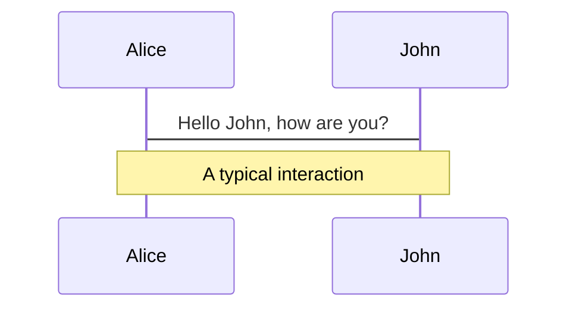
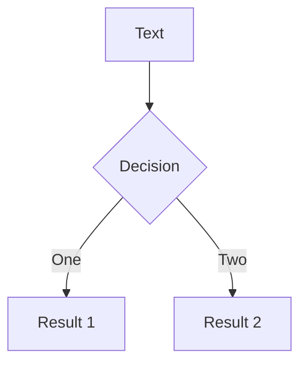
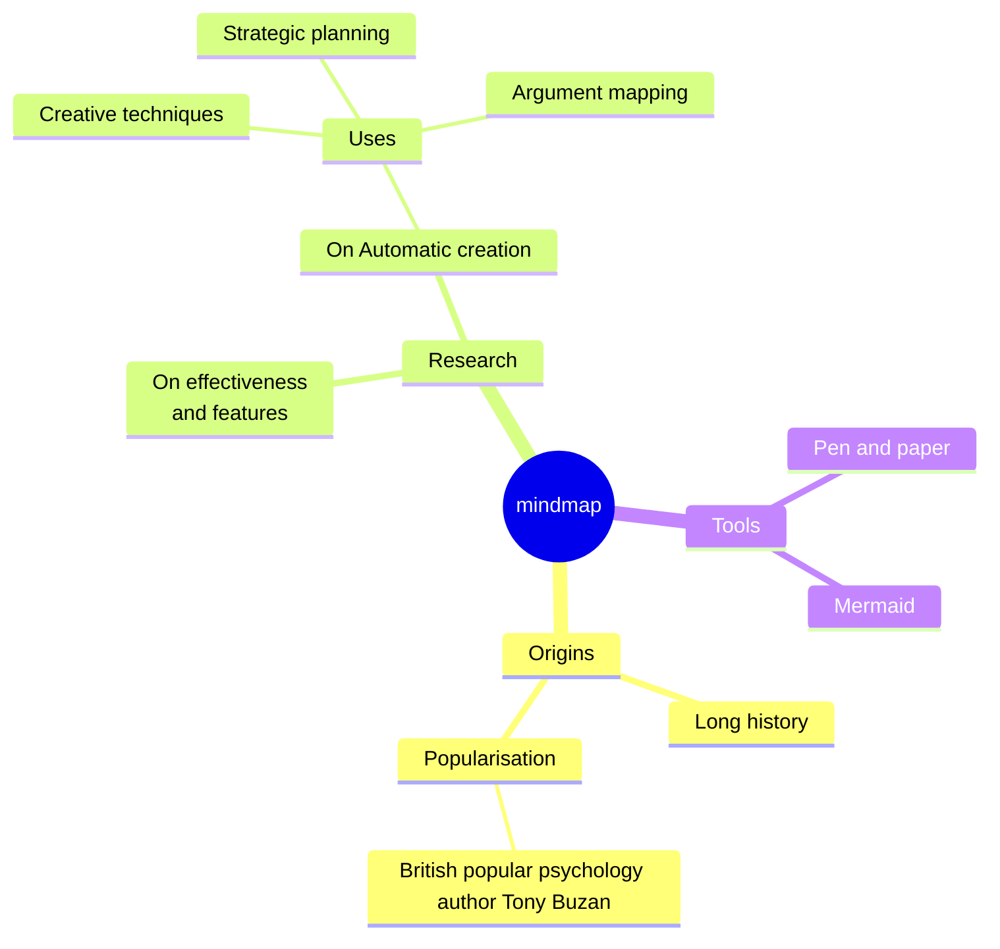
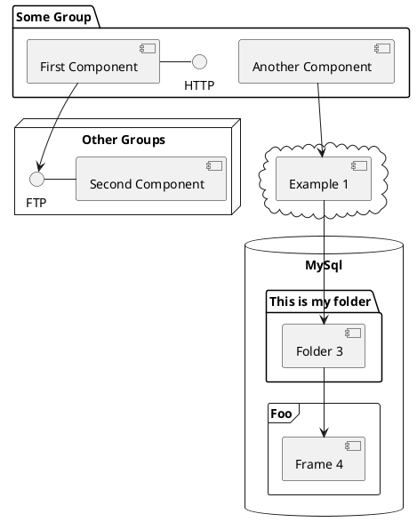

---
# You can also start simply with 'default'
theme: ../marcelkoch.net
# random image from a curated Unsplash collection by Anthony
# like them? see https://unsplash.com/collections/94734566/slidev
image: ./images/title.png
# some information about your slides (markdown enabled)
title: Ein Core, sie zu rosten
info: |
  ## Slidev Starter Template
  Presentation slides for developers.

  Learn more at [Sli.dev](https://sli.dev)
# apply unocss classes to the current slide
class: text-center
# https://sli.dev/features/drawing
drawings:
  persist: false
# slide transition: https://sli.dev/guide/animations.html#slide-transitions
transition: none
# enable MDC Syntax: https://sli.dev/features/mdc
mdc: true
# open graph
# seoMeta:
#  ogImage: https://cover.sli.dev
fonts:
  family: 'Asap'
  headings: 'Asap Condensed'
  body: 'Asap'
  monospace: 'Ubuntu Mono'
colors:
  primary: '#5B0993'
  secondary: '#FD722B'
  tertiary: '#1F859D'
  background: '#fdfcfd'
  text: '#1a1a1a'
  link: '#7426AA'
  code: '#013E4C'
layout: image
---

---
layout: cover
---

# Ein Core, sie zu rosten

<v-clicks>
Langlebige & flexible Cross-Platform-Applikationen
</v-clicks>

---
layout: image
image: ./images/MK.png
---

---
layout: image-right
image: ./images/why-cross-plaform.png
---

## Warum Cross-Platform?

- Webtechnologien dominieren
- Native Apps weiterhin wichtig (z.B. Hardwarezugriffe, Performance)

### Native Apps bieten...

| Vorteile        | Nachteile                        |
|-----------------|----------------------------------|
| Performance     | spezifische Code Base            |
| Look & Feel     | unterschiedliche Konzepte / APIs |
| Hardwarezugriff | umständliche Installation        |


---

# Cross-platform frameworks

|              | **Flutter** | **React Native**        | Xamarin / MAUI | Kotlin Multiplattform | **Qt**         |
|--------------|-------------|-------------------------|----------------|-----------------------|----------------|
| **Language** | Dart        | JavaScript / TypeScript | C#             | Kotlin                | C++            |
| **Company**  | Google      | Facebook                | Microsoft      | Jetbrains             | The Qt company |

---
layout: image-left-mask
image: ./images/good-for-short-term-solutions.png
clipPath: inset(0 0 0 0 round 0 100% 100% 0)
---

## Gut für schnelle Ergebnisse

- Schnelle Ergebnisse durch (oft dynamische) Sprachen
- Gut für kurzlebige Apps (1–2 Jahre)
- Für langlebige Projekte (10+ Jahre) kritischer zu betrachten:
  - Wird das Framework langfristig gepflegt?
  - Reicht Support für Android/iOS/Web?
  - Genügt Performance einer WebView?
  - Wie gut ist die Testbarkeit?
  - Finde ich langfristig Entwickler?

---
layout: image-right
image: ./images/rust-core-2.png
---

## Langlebigkeit durch separaten Core

- UI-Technologie wandelt sich schnell
- Idee: Trennung von Core & UI (z. B. hexagonale Architektur)
- Core enthält Geschäftslogik und stabile Bestandteile
- UI und Plattform-APIs als externe Ports
- Beispiele für Ports: Kamera, Dateisystem, UI

---
layout: image-left
image: ./images/hexagonal.png
---

## Ports and Adapters

- Render: Port
- UI: Adapter


---
layout: image-right
image: ./images/which-language.png
---

## Wahl der Core-Sprache

- Zielplattformen: Android, iOS, Windows, macOS, Raspberry Pi
- Wichtige Kriterien:
  - Stabilität (wenig grundlegende Änderungen)
  - Robustheit (gut wartbarer Code)
  - Langlebigkeit (Unterstützung durch große Firmen)
  - Flexibilität (Einsetzbarkeit auf vielen Plattformen inkl. Web)

---
layout: image-right
image: ./images/rust-for-core.png
---

## Rust für den Core

- Wartbarer, performanter Core mit Rust
- Plattformunterstützung: Desktop, Mobile, Web (via WASM), SBCs
- Explizite Syntax und Compiler unterstützen langfristige Wartbarkeit
- Lernkurve höher, kleinere Community als JS oder C
- Wachsende Community, viele Migrationen von C nach Rust
- Unterstützung durch Firmen wie AWS, Google, Meta, Microsoft

---

## Architektur des Cores

- Mehr Logik im Core = mehr Wiederverwendbarkeit
- UI wird schlanker und reagiert auf ViewModel


--

## Architekturprinzip MVVM

- ViewModel kapselt Anzeige-Daten
- View liest ViewModel, UI bleibt zustandslos
- Beispiel in Rust:
  ```rust
  ViewModel {
    name: String,
    email: String
  }
  ```

---

## UI-Aktionen als fachliche Aktionen (Domain Events)

- UI-Events wie `onClick` werden in fachliche Aktionen übersetzt
- Aktionen sind die Eingangsschnittstelle in den Core
- Beispiel in Rust (Speichern von E-Mail und Name):
  ```rust
  pub enum Actions {
    ChangeName(String),
    ChangeEMail(String),
    ApplyChanges,
  }
  ```

---

## Zustand im Core

- Core verwaltet den Zustand, nicht die UI
- Beispiel:
  ```rust
  struct State {
    name: String,
    email: String
  }
  ```

---
layout: two-cols-header
---

## Implementierung des Core

- Zentrale Struct `App` verarbeitet Aktionen und liefert ViewModel
- Trennung von State, Actions und ViewModel

::left::

```rust {all|8-19|9-17|10-12|18} twoslash
impl Core {
    pub fn new() -> Core {
        Core {
           state: State::default()
        }
    }

    pub fn do_action(&mut self, action: Actions) -> ViewModel {
        match action {
            Actions::ChangeName(name) => {
                self.state.name = name;
            }
            Actions::ChangeEMail(email) => {
                self.state.email = email;
            }
            Actions::ApplyChanges => {}
        }
        self.render_view_model()
    }
```

::right::

```rust {all|2-5|3|all} twoslash
    pub fn render_view_model(&self) -> ViewModel {
        ViewModel{
            name: self.state.name.clone(),
            email: self.state.email.clone()
        }
    }
}

impl Default for Core {
    fn default() -> Self {
        Self::new()
    }
}
```

---
layout: two-cols-header
---

## Validierung im Core (1)

- ViewModel enthält auch Fehlermeldungen
- E-Mail-Validierung im Core
- Beispiel: Prüfung auf `@`

::left::
```rust {all|1-3|5-8|12} twoslash
enum EMailErrors {
    NoAt,
}

struct StateField<F, E> {
    field: F,
    error: Option<E>,
}

struct State {
    name: String,
    email: StateField<String, EMailErrors>,
}
```
::right::
```rust {all|1-4|8} twoslash
pub struct ViewModelField<F> {
  value: F,
  error: Option<String>,
}

pub struct ViewModel {
  pub name: String,
  pub email: ViewModelField<String>,
}
```

---
layout: two-cols-header
---

## Validierung im Core (2)

- In `do_action()` und `render_view_model()`

::left::

```rust {all|1-5|7-10} twoslash
Actions::ChangeEMail(email) => {
    let email_error = if email.contains("@") {
        None
    } else {
        Some(NoAt)
    };

    self.state.email = StateField {
        field: email,
        error: email_error,
    };
}
```
::right::
```rust {all|3-9|4|5-8} twoslash
ViewModel {
        name: self.state.name.clone().into(),
        email: ViewModelField {
            value: self.state.email.field.clone().into(),
            error: match &self.state.email.error {
                None => None,
                Some(_err) => Some("Keine valide E-Mail-Adresse".into()),
            },
        },
    }
```

---
layout: image-grid
image: ./images/crux.png
---

## Crux

- Actions sind Events
- State ist Model
- App
- Effect (Was raus geht)
- Command (Erst Effect, dann Event)
- Operation (Request-Payload)

---
layout: image
image: ./images/architecture.svg
---

---
layout: two-cols
---

```rust {all|1-4|6-9|11-14|16-19|21-22} twoslash
#[derive(Deserialize, Serialize)]
pub enum Event {
    ChangeEmail(String),
}

#[derive(Default)]
pub struct Model {
    email: String,
}

#[derive(Deserialize, Serialize)]
pub struct ViewModel {
    pub email: String,
}

#[effect]
pub enum Effect {
    Render(RenderOperation),
}

#[derive(Default)]
pub struct EmailApp;
```

::right::

```rust  {all|2-6|8-18|20-24} twoslash
impl App for EmailApp {
  type Event = Event;
  type Model = Model;
  type ViewModel = ViewModel;
  type Capabilities = ();
  type Effect = Effect;

  fn update(
    &self,
    event: Self::Event,
    model: &mut Self::Model,
    _caps: &Self::Capabilities,
  ) -> Command<Self::Effect, Self::Event> {
    match event {
      Event::ChangeEmail(email) => model.email = email.clone(),
    }
    render()
  }

  fn view(&self, model: &Self::Model) -> Self::ViewModel {
    ViewModel {
      email: model.email.clone(),
    }
  }
}
```
---
layout: image
image: ./images/architecture.svg
---

---
layout: two-cols
---

## Core

- Umschließt die App
- Hält das Model versteckt

```rust {all|1|3-4|6-14} twoslash
let core: Arc<Core<EmailApp>> = Arc::new(Core::new());

let effects: Vec<Effect> =
    core.process_event(ChangeEmail("m@rcelko.ch".into()));

for effect in effects {
  match effect {
    Effect::Render(_) => {
      let view_model = core.view();
      
      assert_eq!(view_model.email, "m@rcelko.ch")
    }
  }
}
```

::right::

## Bridge

- Umschließt den Core
- Kümmert sich um (De)serialisierung

```rust {all|1-2|4|6-7|9-22} twoslash
let serialized = 
    bincode::serialize(&ChangeEmail("m@rcelko.ch".into())).unwrap();

let effects: Vec<u8> = bridge.process_event(&serialized).unwrap();

let effects: Vec<Request<EffectFfi>> =
bincode::deserialize(effects.as_slice()).unwrap();

for request in effects {
  let effect = request.effect;
  
  match effect {
    EffectFfi::Render(_) => {
    let view_model = bridge.view().unwrap();
    let view_model: ViewModel =
    bincode::deserialize(&view_model).unwrap();
    
    assert_eq!(view_model.email, "m@rcelko.ch")
    }
  }
}
```

---
layout: image
image: ./images/architecture.svg
---

---
layout: two-cols
---

````md magic-move {lines: true}
```rust
#[derive(Deserialize, Serialize)]
pub enum Event {
    ChangeEmail(String),
}

#[derive(Default)]
pub struct Model {
    email: String,
}

#[derive(Deserialize, Serialize)]
pub struct ViewModel {
    pub email: String,
}

#[effect]
pub enum Effect {
    Render(RenderOperation),
}

#[derive(Default)]
pub struct EmailApp;
```

```rust {all|4,10,16,22|22} twoslash
#[derive(Deserialize, Serialize)]
pub enum Event {
    ChangeEmail(String),
    EmailSent(bool),
}

#[derive(Default)]
pub struct Model {
    email: String,
    sent: bool,
}

#[derive(Deserialize, Serialize)]
pub struct ViewModel {
    pub email: String,
    pub sent_message: Option<String>,
}

#[effect]
pub enum Effect {
    Render(RenderOperation),
    StartWritingEmail(StartWritingEmailOp),
}

#[derive(Default)]
pub struct EmailApp;
```

```rust {6|5-6|9-16|9-12|14-16} twoslash
// ...

#[effect]
pub enum Effect {
    Render(RenderOperation),
    StartWritingEmail(StartWritingEmailOp),
}

#[derive(Deserialize, Serialize, Clone, PartialEq, Debug)]
pub struct StartWritingEmailOp {
    pub subject: String,
}

impl Operation for StartWritingEmailOp {
    type Output = bool;
}
```

````

::right::

````md magic-move {lines: true}
```rust  {all|2-7|8-13} twoslash
impl App for EmailApp {
  fn update(...) -> Command<Self::Effect, Self::Event> {
    match event {
      Event::ChangeEmail(email) => model.email = email.clone(),
    }
    render()
  }
  
  fn view(&self, model: &Self::Model) -> Self::ViewModel {
    ViewModel {
      email: model.email.clone(),
    }
  }
}
```

```rust  {all|7-12|14-17|11,14-17|23-27} twoslash
impl App for EmailApp {
  fn update(...) -> Command<Self::Effect, Self::Event> {
        match event {
            Event::ChangeEmail(email) => {
                model.email = email.clone();

                let command: Command<Self::Effect, Self::Event> =
                    Command::request_from_shell(StartWritingEmailOp {
                        subject: "Moin!".into(),
                    })
                    .then_send(|output| Event::EmailSent(output));
                Command::all([command, render()])
            }
            Event::EmailSent(sent) => {
                model.sent = sent;
                render()
            }
        }
    }
    fn view(&self, model: &Self::Model) -> Self::ViewModel {
        ViewModel {
            email: model.email.clone(),
            sent_message: if model.sent {
                Some("Erfolgreich geschickt".into())
            } else {
                None
            },
        }
    }
}
```
````

---
layout: two-cols
---

## Tests

- Die App direkt testen
- Den Core innerhalb eines Integrationtests testen

::right::

```rust {all|5-8,11|12|14,16,17} twoslash
#[test]
fn simple_test() {
  let app = EmailApp;

  let mut model = Model {
    email: "hello@example.com".to_string(),
    sent: false,
  };

  let event = Event::EmailSent(true);
  let mut cmd = app.update(event, &mut model, &());
  assert_effect!(cmd, Effect::Render(_));

  let view = app.view(&model);

  assert_eq!(view.sent_message.unwrap(),
             "Erfolgreich geschickt".to_string());
}
```

---
layout: image-right
image: ./images/glue-tech.png
---

## Anbindung an die Shell

Kleber für die Tapete

- uniffi (& serde_generate)
- wasm-pack
- Flutter Rust Bridge
- FFI

---
layout: two-cols
---

## uniFFI
- Mit Macros (oder interface definition file) Funktionsschnittstellen in Fremdsprachen generieren

::right::

```rust  {all|4} twoslash
static CORE: LazyLock<Bridge<EmailApp>>
    = LazyLock::new(|| Bridge::new(Core::new()));

#[uniffi::export]
#[must_use]
pub fn process_event(data: &[u8]) -> Vec<u8> {
  match CORE.process_event(data) {
    Ok(effects) => effects,
    Err(e) => panic!("{e}"),
  }
}
```
---
layout: two-cols
---

## serde_generate
- Generierte komplexe Typen in Fremdsprachen

::right::

```rust  {all} twoslash
use serde_generate::{
  Tracer, code_generator::CodeGeneratorConfig,
  typescript::Installer, bincode::BincodeSerializer,
};

fn main() -> anyhow::Result<()> {
  let mut tracer = Tracer::new(Default::default());
  tracer.trace_type::<cross_platform_crux::Event>()?;
  let registry = tracer.registry()?;

  let out_dir = "bindings/ts";
  std::fs::create_dir_all(out_dir)?;

  Installer::new(out_dir)
          .with_serializer(BincodeSerializer::default())
          .install(&registry)?;

  Ok(())
}
```

---
layout: two-cols
---

## wasm-pack
- Generiert WASM-Modul und JS-Glue-Code

::right::

```rust  {all|4} twoslash
static CORE: LazyLock<Bridge<EmailApp>>
    = LazyLock::new(|| Bridge::new(Core::new()));

#[cfg_attr(target_family = "wasm", wasm_bindgen::prelude::wasm_bindgen)]
#[must_use]
pub fn process_event(data: &[u8]) -> Vec<u8> {
  match CORE.process_event(data) {
    Ok(effects) => effects,
    Err(e) => panic!("{e}"),
  }
}
```

```typescript [cross_platform_crux.d.ts] {all|1}
export function process_event(data: Uint8Array): Uint8Array;
```

---
layout: two-cols
---

## Flutter Rust Bridge
- Rust-Code in Flutter-Projekt integrieren

```rust [frb_cross_platform_core.rs]
static CORE_CELL: OnceLock<EmailAppCore> = OnceLock::new();

#[frb(sync)]
pub fn init_app_and_get_view_model() -> ViewModel {
  let core = cross_platform_rust::create_core();
  let view_model = core.view();
  let _ = CORE_CELL.set(core);
  view_model
}

#[frb(mirror(Event))]
#[frb(dart_metadata=("freezed"))] // generates dart classes
pub enum _Event {
  ChangeEmail(String),
  EmailSent(bool),
}
```

::right::

```dart
import 'package:cross_platform_rust_app/src/rust/api/frb_cross_platform_core.dart';
import 'package:cross_platform_rust_app/src/rust/frb_generated.dart';

Future<ViewModel> initRustCore() async {
  await RustLib.init();
  
  final viewModel = initAppAndGetViewModel();

  return viewModel;
}
```
---
layout: image-left
image: ./images/customer.png
---

# Es kam einmal ein Kunde

- C
  - War gesetzt
  - Ist gesetzt
- Worauf bauen wir die UI?
  - Flutter
  - React Native

---

## Erfahrungen aus der Praxis

- C
- uniffi - c# ist nicht so einfach
- Mehr als crux liefert
- CI/CD

---
layout: image-right
image: ./images/c-build.png
---

# Um C zu unterstützen...

- bauen wir libs vor
- unterstützen wir 11 targets
- binden wir die libs in die `build.rs` mit eigenem Tool `grab-n-spread` ein
- C-Integration an sich kein Problem
- Cross compiling sehr wohl
  - Windows: .lib falsche Berechnung
  - dockcross
  - osxcross

---

## Mehr als crux mitbringt

- I18N (integriert im Kompilat)
- Labels
- Logging

---
layout: image-right
image: ./images/rust-for-core.png
---

## Zusammenfassung

- Architektur trennt langlebigen Core von kurzlebiger UI
- Core übernimmt soviel wie möglich: Zustand, Logik, Validierung
- Mögliche Lösung: Rust, crux, Flutter, FRB

---
layout: image
image: ./images/MK-end.png
---


---

# The (un)holy trinity of Flutter, Rust and C

Cross platform apps based on Rust

<div @click="$slidev.nav.next" class="mt-12 py-1" hover:bg="white op-10">
  Press Space for next page <carbon:arrow-right />
</div>

<div class="abs-br m-6 text-xl">
  <button @click="$slidev.nav.openInEditor()" title="Open in Editor" class="slidev-icon-btn">
    <carbon:edit />
  </button>
  <a href="https://github.com/slidevjs/slidev" target="_blank" class="slidev-icon-btn">
    <carbon:logo-github />
  </a>
</div>

<!--
The last comment block of each slide will be treated as slide notes. It will be visible and editable in Presenter Mode along with the slide. [Read more in the docs](https://sli.dev/guide/syntax.html#notes)
-->

---
transition: fade-out
background: '#470674'
---

# Cross-platform apps based on Rust

- For short 

<v-clicks>

- Hello
- Bla
- Blub

</v-clicks>

---
transition: fade-out
background: '#470674'
---

# Different cross-platform options

|                          | **Flutter** | **React Native**        | Xamarin / MAUI | **Qt**         |
|--------------------------|-------------|-------------------------|----------------|----------------|
| **Language**             | Dart        | JavaScript / TypeScript |                | C++            |
| **Company  / Backed by** | Google      | Facebook                | Microsoft      | The Qt company |


- For short-term apps it's a good thing
- but for long term apps that should last for more than 10 years?

---

# Separate the UI and the core

---

# Why Rust for the core?

---

# Put as much as possible in the core

---
transition: fade-out
background: '#470674'
---

# What is Slidev?

Slidev is a slides maker and presenter designed for developers, consist of the following features

- 📝 **Text-based** - focus on the content with Markdown, and then style them later
- 🎨 **Themable** - themes can be shared and re-used as npm packages
- 🧑‍💻 **Developer Friendly** - code highlighting, live coding with autocompletion
- 🤹 **Interactive** - embed Vue components to enhance your expressions
- 🎥 **Recording** - built-in recording and camera view
- 📤 **Portable** - export to PDF, PPTX, PNGs, or even a hostable SPA
- 🛠 **Hackable** - virtually anything that's possible on a webpage is possible in Slidev
<br>
<br>

Read more about [Why Slidev?](https://sli.dev/guide/why)

<!--
You can have `style` tag in markdown to override the style for the current page.
Learn more: https://sli.dev/features/slide-scope-style
-->

<style>
h1 {
  background-color: #2B90B6;
  background-image: linear-gradient(45deg, #4EC5D4 10%, #146b8c 20%);
  background-size: 100%;
  -webkit-background-clip: text;
  -moz-background-clip: text;
  -webkit-text-fill-color: transparent;
  -moz-text-fill-color: transparent;
}
</style>

<!--
Here is another comment.
-->

---
transition: slide-up
level: 2
---

# Navigation

Hover on the bottom-left corner to see the navigation's controls panel, [learn more](https://sli.dev/guide/ui#navigation-bar)

## Keyboard Shortcuts

|                                                     |                             |
| --------------------------------------------------- | --------------------------- |
| <kbd>right</kbd> / <kbd>space</kbd>                 | next animation or slide     |
| <kbd>left</kbd>  / <kbd>shift</kbd><kbd>space</kbd> | previous animation or slide |
| <kbd>up</kbd>                                       | previous slide              |
| <kbd>down</kbd>                                     | next slide                  |

<!-- https://sli.dev/guide/animations.html#click-animation -->

<p v-after class="absolute bottom-23 left-45 opacity-30 transform -rotate-10">Here!</p>

---
layout: two-cols
layoutClass: gap-16
---

# Table of contents

You can use the `Toc` component to generate a table of contents for your slides:

```html
<Toc minDepth="1" maxDepth="1" />
```

The title will be inferred from your slide content, or you can override it with `title` and `level` in your frontmatter.

::right::

<Toc text-sm minDepth="1" maxDepth="2" />

---
layout: image-right
image: https://cover.sli.dev
---

# Code

Use code snippets and get the highlighting directly, and even types hover!

```ts [filename-example.ts] {all|4|6|6-7|9|all} twoslash
// TwoSlash enables TypeScript hover information
// and errors in markdown code blocks
// More at https://shiki.style/packages/twoslash
import { computed, ref } from 'vue'

const count = ref(0)
const doubled = computed(() => count.value * 2)

doubled.value = 2
```

<arrow v-click="[4, 5]" x1="350" y1="310" x2="195" y2="342" color="#953" width="2" arrowSize="1" />

<!-- This allow you to embed external code blocks -->
<<< @/snippets/external.ts#snippet

<!-- Footer -->

[Learn more](https://sli.dev/features/line-highlighting)

<!-- Inline style -->
<style>
.footnotes-sep {
  @apply mt-5 opacity-10;
}
.footnotes {
  @apply text-sm opacity-75;
}
.footnote-backref {
  display: none;
}
</style>

<!--
Notes can also sync with clicks

[click] This will be highlighted after the first click

[click] Highlighted with `count = ref(0)`

[click:3] Last click (skip two clicks)
-->

---
level: 2
---

# Shiki Magic Move

Powered by [shiki-magic-move](https://shiki-magic-move.netlify.app/), Slidev supports animations across multiple code snippets.

Add multiple code blocks and wrap them with <code>````md magic-move</code> (four backticks) to enable the magic move. For example:

````md magic-move {lines: true}
```ts {*|2|*}
// step 1
const author = reactive({
  name: 'John Doe',
  books: [
    'Vue 2 - Advanced Guide',
    'Vue 3 - Basic Guide',
    'Vue 4 - The Mystery'
  ]
})
```

```ts {*|1-2|3-4|3-4,8}
// step 2
export default {
  data() {
    return {
      author: {
        name: 'John Doe',
        books: [
          'Vue 2 - Advanced Guide',
          'Vue 3 - Basic Guide',
          'Vue 4 - The Mystery'
        ]
      }
    }
  }
}
```

```ts
// step 3
export default {
  data: () => ({
    author: {
      name: 'John Doe',
      books: [
        'Vue 2 - Advanced Guide',
        'Vue 3 - Basic Guide',
        'Vue 4 - The Mystery'
      ]
    }
  })
}
```

Non-code blocks are ignored.

```vue
<!-- step 4 -->
<script setup>
const author = {
  name: 'John Doe',
  books: [
    'Vue 2 - Advanced Guide',
    'Vue 3 - Basic Guide',
    'Vue 4 - The Mystery'
  ]
}
</script>
```
````

---

# Components

<div grid="~ cols-2 gap-4">
<div>

You can use Vue components directly inside your slides.

We have provided a few built-in components like `<Tweet/>` and `<Youtube/>` that you can use directly. And adding your custom components is also super easy.

```html
<Counter :count="10" />
```

<!-- ./components/Counter.vue -->
<Counter :count="10" m="t-4" />

Check out [the guides](https://sli.dev/builtin/components.html) for more.

</div>
<div>

```html
<Tweet id="1390115482657726468" />
```

<Tweet id="1390115482657726468" scale="0.65" />

</div>
</div>

<!--
Presenter note with **bold**, *italic*, and ~~striked~~ text.

Also, HTML elements are valid:
<div class="flex w-full">
  <span style="flex-grow: 1;">Left content</span>
  <span>Right content</span>
</div>
-->

---
class: px-20
---

# Themes

Slidev comes with powerful theming support. Themes can provide styles, layouts, components, or even configurations for tools. Switching between themes by just **one edit** in your frontmatter:

<div grid="~ cols-2 gap-2" m="t-2">

```yaml
---
theme: default
---
```

```yaml
---
theme: seriph
---
```


</div>

Read more about [How to use a theme](https://sli.dev/guide/theme-addon#use-theme) and
check out the [Awesome Themes Gallery](https://sli.dev/resources/theme-gallery).

---

# Clicks Animations

You can add `v-click` to elements to add a click animation.

<div v-click>

This shows up when you click the slide:

```html
<div v-click>This shows up when you click the slide.</div>
```

</div>

<br>

<v-click>

The <span v-mark.red="3"><code>v-mark</code> directive</span>
also allows you to add
<span v-mark.circle.orange="4">inline marks</span>
, powered by [Rough Notation](https://roughnotation.com/):

```html
<span v-mark.underline.orange>inline markers</span>
```

</v-click>

<div mt-20 v-click>

[Learn more](https://sli.dev/guide/animations#click-animation)

</div>

---

# Motions

Motion animations are powered by [@vueuse/motion](https://motion.vueuse.org/), triggered by `v-motion` directive.

```html
<div
  v-motion
  :initial="{ x: -80 }"
  :enter="{ x: 0 }"
  :click-3="{ x: 80 }"
  :leave="{ x: 1000 }"
>
  Slidev
</div>
```

<div class="w-60 relative">
  <div class="relative w-40 h-40">
    
    
    
  </div>

  <div
    class="text-5xl absolute top-14 left-40 text-[#2B90B6] -z-1"
    v-motion
    :initial="{ x: -80, opacity: 0}"
    :enter="{ x: 0, opacity: 1, transition: { delay: 2000, duration: 1000 } }">
    Slidev
  </div>
</div>

<!-- vue script setup scripts can be directly used in markdown, and will only affects current page -->
<script setup lang="ts">
const final = {
  x: 0,
  y: 0,
  rotate: 0,
  scale: 1,
  transition: {
    type: 'spring',
    damping: 10,
    stiffness: 20,
    mass: 2
  }
}
</script>

<div
  v-motion
  :initial="{ x:35, y: 30, opacity: 0}"
  :enter="{ y: 0, opacity: 1, transition: { delay: 3500 } }">

[Learn more](https://sli.dev/guide/animations.html#motion)

</div>

---

# LaTeX

LaTeX is supported out-of-box. Powered by [KaTeX](https://katex.org/).

<div h-3 />

Inline $\sqrt{3x-1}+(1+x)^2$

Block
$$ {1|3|all}
\begin{aligned}
\nabla \cdot \vec{E} &= \frac{\rho}{\varepsilon_0} \\
\nabla \cdot \vec{B} &= 0 \\
\nabla \times \vec{E} &= -\frac{\partial\vec{B}}{\partial t} \\
\nabla \times \vec{B} &= \mu_0\vec{J} + \mu_0\varepsilon_0\frac{\partial\vec{E}}{\partial t}
\end{aligned}
$$

[Learn more](https://sli.dev/features/latex)

---

# Diagrams

You can create diagrams / graphs from textual descriptions, directly in your Markdown.

<div class="grid grid-cols-4 gap-5 pt-4 -mb-6">









</div>

Learn more: [Mermaid Diagrams](https://sli.dev/features/mermaid) and [PlantUML Diagrams](https://sli.dev/features/plantuml)

---
foo: bar
dragPos:
  square: 691,29,167,_,-16
---

# Draggable Elements

Double-click on the draggable elements to edit their positions.

<br>

###### Directive Usage

```md

```

<br>

###### Component Usage

```md
<v-drag text-3xl>
  <div class="i-carbon:arrow-up" />
  Use the `v-drag` component to have a draggable container!
</v-drag>
```

<v-drag pos="366,256,261,_,-15">
  <div text-center text-3xl border border-main rounded>
    Double-click me!
  </div>
</v-drag>


###### Draggable Arrow

```md
<v-drag-arrow two-way />
```

<v-drag-arrow pos="158,310,547,-173" two-way op70 />

---
src: ./pages/imported-slides.md
hide: false
---

---

# Monaco Editor

Slidev provides built-in Monaco Editor support.

Add `{monaco}` to the code block to turn it into an editor:

```ts {monaco}
import { ref } from 'vue'
import { emptyArray } from './external'

const arr = ref(emptyArray(10))
```

Use `{monaco-run}` to create an editor that can execute the code directly in the slide:

```ts {monaco-run}
import { version } from 'vue'
import { emptyArray, sayHello } from './external'

sayHello()
console.log(`vue ${version}`)
console.log(emptyArray<number>(10).reduce(fib => [...fib, fib.at(-1)! + fib.at(-2)!], [1, 1]))
```

---
layout: center
class: text-center
---

# Learn More

[Documentation](https://sli.dev) · [GitHub](https://github.com/slidevjs/slidev) · [Showcases](https://sli.dev/resources/showcases)

<PoweredBySlidev mt-10 />
